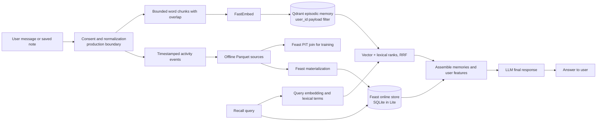

# Hybrid Memory for a Vietnamese Personal Assistant

POC này dùng FastEmbed bge-small, Qdrant in-memory và Feast/SQLite (Lite). Model thiên về tiếng Anh nên chất lượng truy vấn tiếng Việt phải được đo, không được giả định.

`remember()` ghi các chunk có timestamp theo `user_id` mà caller truyền vào; POC chưa xác thực danh tính, thu consent hay chuẩn hóa văn bản. Trong production, caller phải kiểm tra consent và lấy `user_id` từ danh tính đã xác thực trước khi gọi agent. `recall()` lọc Qdrant theo user, hợp nhất thứ hạng vector/từ khóa bằng RRF, rồi đọc profile và activity từ Feast. Context được trả cho caller để LLM tạo câu trả lời; POC không gọi model ngoài. Dữ liệu train dùng PIT join để mỗi sự kiện chỉ thấy feature đã tồn tại tại thời điểm đó.

## Decision 1 — Chunking strategy

I choose chunks capped at roughly 80 whitespace-delimited words, with a small overlap. A real service should calibrate the cap against the embedding tokenizer; this POC uses word counts to stay dependency-light. A whole conversation can mix topics, dilute its vector, and consume the LLM context window. One chunk per sentence can lose references such as “cách đó” and creates more index overhead. Bounded groups preserve local context; overlap reduces boundary loss but adds storage and can return near-duplicates. Production can merge adjacent hits before generation and apply per-user retention limits.

## Decision 2 — Feature schema

I keep explicit profile values tabular and use vectors for episodic text. The stable `user_profile_features` view is keyed by Feast entity `user_id`, sourced from profile snapshots in Parquet, and has a 30-day TTL. Its fields include `preferred_language` (STRING), `reading_speed_wpm` (INT64), and `topic_affinity` (STRING). The recent `query_velocity_features` view uses the same user entity and an event stream or micro-batched Parquet source; `queries_last_hour` and `distinct_topics_24h` expire after one hour. Feast's online SQLite store serves the latest values in Lite, while the offline source supports reproducible training joins. This split makes slow preferences and fast behavior independently refreshable.

Tradeoff là khả năng kiểm tra so với độ biểu đạt. Profile dạng bảng dễ audit và giải thích (“thích bài cloud”); embedding sở thích tinh tế hơn nhưng khó debug, gắn với version model và cần tính lại khi đổi model. Vì vậy Feast giữ preference/counter tường minh, còn vector store biểu diễn ngữ nghĩa của memory. Chỉ thêm embedding profile nếu đánh giá offline chứng minh được lợi ích.

## Decision 3 — Freshness strategy

Freshness follows how quickly a fact becomes stale. When a user saves a note or finishes reading, synchronous Qdrant upsert makes recall see it within a second; this adds a request-path write but supports “what did I just read?”. Query velocity is streaming: a consumer updates continuously or in sub-minute micro-batches, with a one-hour TTL. It costs more than batch but avoids using yesterday's activity for the current session. Preferred language and reading speed can refresh daily with a 30-day TTL; explicit user corrections apply immediately. Daily refresh is cheaper than per-event writes for slow preferences. A five-minute batch suits popularity aggregates that do not need sub-second freshness.

Trong POC, activity chỉ được tạo thành Parquet tổng hợp và materialize ở NB4; luồng streaming/sub-minute ở trên là thiết kế mục tiêu, chưa được cài trong `bonus/agent.py`.

## Rejected alternative

I considered putting conversation chunks and profile fields into one Feast feature view. I rejected it because episodic text is unbounded, changes on every interaction, and needs nearest-neighbor search with user isolation; Feast feature views are keyed, typed, time-aware columns and are better for point lookups and training-serving consistency. Combining the two would either force text into an unsuitable tabular schema or force stable profile values through an expensive vector retrieval path. Separate stores also let each data class use an appropriate retention and freshness policy.

## Vietnamese language and privacy

Vietnamese users code-switch: “tối ưu autoscaling cho cluster Kubernetes này.” I preserve raw text and normalize a copy for lexical matching, without translating technical names. Telex can produce unaccented or mistyped text such as “mo rong ha tang”; query normalization and accent-insensitive aliases can improve recall while raw text stays authoritative. Whitespace is fast but Vietnamese syllables may form one lexical unit. `pyvi` or `underthesea` improve BM25 tokenization, at the cost of latency, dictionary maintenance, and possible damage to English code identifiers. Keep original text for dense embeddings, version the Vietnamese tokenizer for sparse search, and reindex when its rules change. Lite's English model is weak on Vietnamese paraphrases; a multilingual model changes vector dimensions and requires a Qdrant rebuild.

Every recall filters by the `user_id` argument. The POC does not authenticate that argument; a production caller must derive it from verified identity rather than arbitrary client input. Payload filtering helps isolate users, but is not encryption or full authorization. Production still needs consent enforcement, deletion/export, encryption at rest, audit, and clear retention. This POC loses memories on process exit and has no multi-device sync, deletion workflow, or LLM generation. These limits keep the demo small while showing the boundary between episodic retrieval and stable personalization.
